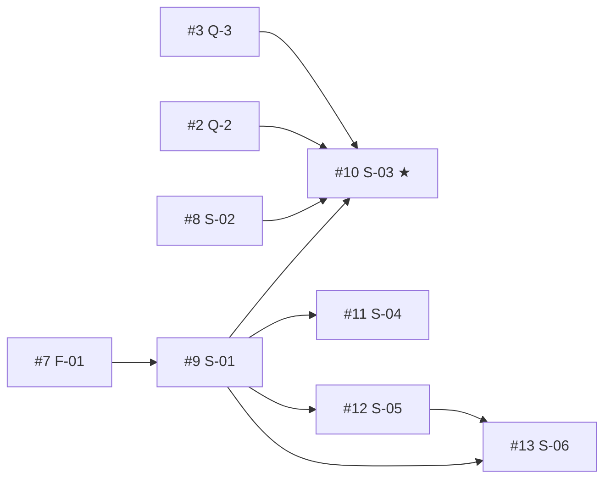

# Management — GitHub mirror of roadmap.md

> [!IMPORTANT]
> **`context/foundation/roadmap.md` is the source of truth.** GitHub Issues is a **mirror** for day-to-day
> tracking. When the two disagree, fix GitHub to match the roadmap — never the other way round, unless the
> roadmap itself is being edited on purpose (then update both in the same sitting).

- **Repo:** `dkozinski/10xCards` (public — every issue is world-readable)
- **Mirrors:** milestone M-1 of `roadmap.md` (roadmap `version: 1`, migrated 2026-09-19)
- **Tooling:** plain `gh` CLI; no GitHub Actions, no sync bot

## What exists on GitHub

| Construct | State |
| --- | --- |
| Milestone `M-1: Paste-to-review loop` (#1) | open — 13 open / 0 closed |
| Issues #1–#13 | all open |
| 9 custom labels | created |
| 9 native "blocked by" dependencies | created |
| Projects board "10xCards Roadmap" | **not created yet** — token now has `project` scope; step pending |

## Mapping: roadmap → GitHub

| Roadmap concept | GitHub construct |
| --- | --- |
| Milestone M-1 | **Milestone** `M-1: Paste-to-review loop` (description = intent + done-when) |
| Foundation F-NN / slice S-NN | one **issue**, title `[S-01] <suggested title from Backlog Handoff>` |
| Open Roadmap Question n | one **issue**, title `[Q-n] <question>`, label `question` |
| `Prerequisites` | native **"blocked by"** dependency + `#N` link in the body |
| `Status` (ready / proposed / blocked) | label `status:*` |
| `Status: done` | issue **closed** (and roadmap `## Done` via `/10x-archive`) |
| Stream A / B / C | label `stream:*` |
| North star | label `north-star` |
| `## Parked` | **not mirrored** — explicit non-goals stay only in the roadmap |
| Change ID | written in the issue body; becomes `context/changes/<change-id>/` via `/10x-new` |

## Issue inventory

| Issue | Roadmap ID | Change ID | Labels | Blocked by |
| --- | --- | --- | --- | --- |
| #7 | F-01 | `deck-data-contract` | `type:foundation` `status:ready` `stream:A-deck` | — |
| #8 | S-02 | `ai-proposals-from-text` | `type:slice` `status:ready` `stream:B-ai` | — |
| #9 | S-01 | `manual-card-and-deck` | `type:slice` `status:proposed` `stream:A-deck` | #7 |
| #10 | S-03 | `review-and-save-proposals` | `type:slice` `status:blocked` `stream:B-ai` `north-star` | #9, #8, #2, #3 |
| #11 | S-04 | `edit-and-delete-cards` | `type:slice` `status:proposed` `stream:A-deck` | #9 |
| #12 | S-05 | `srs-review-session` | `type:slice` `status:proposed` `stream:C-review` | #9 |
| #13 | S-06 | `account-and-data-deletion` | `type:slice` `status:proposed` `stream:C-review` | #9, #12 |

| Issue | Question | Blocks | Blocking? |
| --- | --- | --- | --- |
| #1 | Q-1 Character limit on pasted text | S-02 (#8) | no — body link only |
| #2 | Q-2 Are rejections recorded in aggregate? | S-03 (#10) | **yes** — native dependency |
| #3 | Q-3 Does an edited proposal count as AI-created? | S-03 (#10) | **yes** — native dependency |
| #4 | Q-4 Grade history on edit: keep or reset? | S-04, S-05 | no — body link only |
| #5 | Q-5 How is account deletion confirmed? | S-06 (#13) | no — body link only |
| #6 | Q-6 Automated checks for the two guardrails? | roadmap-wide | no |

> [!NOTE]
> Only **blocking** questions become native dependencies. Non-blocking ones are linked from the slice body
> ("Unknowns" section) so they don't show a false "Blocked" badge.

### Dependency graph



> [!TIP]
> **Where to start:** #7 (F-01) and #8 (S-02) have no blockers and are labelled `status:ready`. To unblock the
> north star (#10) you have to **answer** #2 and #3. Those are product decisions, not code.

## Label vocabulary

| Label | Meaning |
| --- | --- |
| `type:foundation` | bounded enabler, no user-visible change (F-NN) |
| `type:slice` | user-visible end-to-end slice (S-NN) |
| `question` | open roadmap question (GitHub default label, reused) |
| `status:ready` | ready for `/10x-plan` |
| `status:proposed` | waiting on prerequisites |
| `status:blocked` | waiting on an open **decision** (not just a prerequisite) |
| `stream:A-deck` | Stream A — deck and data ownership |
| `stream:B-ai` | Stream B — AI drafting |
| `stream:C-review` | Stream C — review loop and closure |
| `north-star` | the slice that settles the central product bet (S-03) |

> [!WARNING]
> This label set is a **closed vocabulary**. Don't create new `status:*` / `type:*` labels ad hoc. A new
> label means the roadmap schema changed, and this file should change with it.

## Issue body formats

### Slice / foundation

The roadmap's Backlog Handoff says issues **must not duplicate the detailed roadmap body**, so the issue body is kept short:

- **Outcome** — one sentence, copied from the roadmap
- **Field table** — Roadmap ID, Change ID, PRD refs, Stream, Prerequisites (`#N`), Parallel with, Ready for `/10x-plan`
- **Unknowns** — `#N (Q-n), blocking: yes/no`, or `none`
- **Why this order (risk, summarised)** — 2–3 sentences condensed from the roadmap's Risk paragraph
- **Done when** — checkboxes; always ends with *"Change `<change-id>` archived via `/10x-archive`"*
- Footer: `Source: context/foundation/roadmap.md § S-NN` (plain text, not a link; see Known gaps)

### Question

- **Question**, then a field table: Roadmap ID, Owner, PRD Open Question, Affects, Blocking
- **Context** — why the answer matters
- **Decision** — placeholder: *"Not yet decided. Record the answer here, update the PRD/roadmap, then close."*

## Lifecycle: keeping the mirror in sync

| Event | In GitHub | In the repo |
| --- | --- | --- |
| Pick up a slice | Assign yourself; board Status → In Progress (once the board exists) | `/10x-new <change-id>` |
| Prerequisite closes | Swap label `status:proposed` → `status:ready` if nothing else blocks | Update the `Status` field in roadmap.md |
| Answer a question | Write the answer under **Decision**, then close the Q issue | Update the PRD open question and roadmap Unknowns |
| Both Q-2 and Q-3 closed | #10: `status:blocked` → `status:ready` | S-03 `Status` → ready |
| Slice finished | Close the issue (a PR with `Closes #N` does it automatically on merge to `main`) | `/10x-archive`, which flips roadmap Status → done and appends to `## Done` |
| Roadmap re-generated / new milestone | New milestone plus new issues; close or re-scope stale ones by hand | Update this file's inventory |

> [!NOTE]
> Nothing syncs automatically. Labels and roadmap `Status` fields are updated **by hand**. Closing an
> issue is the only thing GitHub propagates by itself: it clears the "Blocked" badge on the dependents.

**Example (S-01):** once #7 (F-01) is closed, #9 loses its "Blocked" badge. Run
`gh issue edit 9 --remove-label status:proposed --add-label status:ready`, set S-01 `Status: ready` in
roadmap.md, then `/10x-new manual-card-and-deck`.

## `gh` cheatsheet

```bash
# What can I work on?
gh issue list --label status:ready
gh issue list --milestone "M-1: Paste-to-review loop"
gh issue list --label question --state open

# What blocks an issue?
gh api repos/dkozinski/10xCards/issues/10/dependencies/blocked_by --jq '.[] | "#\(.number) \(.title)"'

# Change a status label
gh issue edit 9 --remove-label status:proposed --add-label status:ready

# Add a dependency (API needs the blocker's database id, not its #number)
gh api -X POST repos/dkozinski/10xCards/issues/<blocked>/dependencies/blocked_by \
  -F issue_id=$(gh api repos/dkozinski/10xCards/issues/<blocker> --jq .id)

# Record a decision and close a question
gh issue comment 2 --body "Decision: …" && gh issue close 2
```

## Known gaps

- **Projects board not created.** The planned setup is a user-level Project "10xCards Roadmap" linked to
  the repo. Its built-in **Status** column (Todo / In Progress / Done) would track execution, and a custom
  single-select **Stream** field would group items. All 13 issues would be added to it.
- **`roadmap.md` is untracked in git.** Issue bodies cite its path as plain text, because a blob link
  would 404 until the file is committed.
- **The generator script is not in the repo.** It was a one-off run from a session scratchpad directory.
  Future milestones are migrated fresh using the formats in this file.

## Undo

Everything here lives on GitHub and can be removed:

- `gh issue delete <n> --yes`
- `gh label delete <name> --yes`
- `gh api -X DELETE repos/dkozinski/10xCards/milestones/1`

Only the GitHub copies are lost. The roadmap content lives in `roadmap.md`.
